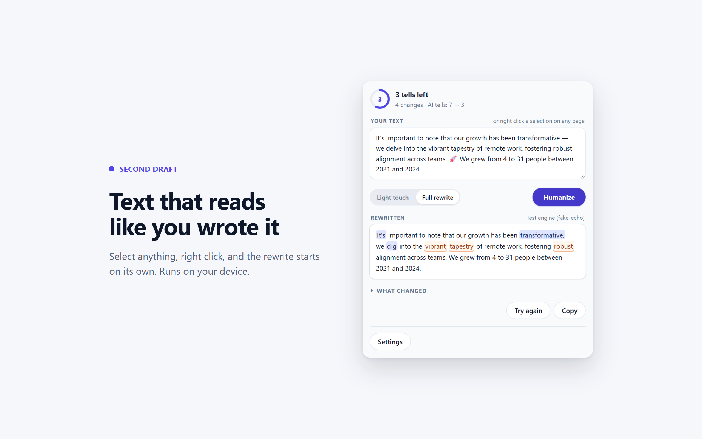

# Second Draft

[](https://github.com/Joel-Wwalker/second-draft/actions/workflows/ci.yml)
[](LICENSE)
[](tests)
[](package.json)

A Chrome extension that rewrites AI-sounding text so it reads like a person
wrote it. Select text on any page, review the edits, apply them in place.



It removes em dashes, AI vocabulary like "delve" and "tapestry", chatbot filler,
forced rule-of-three lists, and other patterns from Wikipedia's "Signs of AI
writing" research.

Rewrites run on your device using Chrome's built-in Gemini Nano. Nothing is sent
anywhere unless you add your own API key.

**[Demo](https://joel-wwalker.github.io/second-draft/)** ·
**[Privacy policy](https://joel-wwalker.github.io/second-draft/privacy-policy)** ·
**[Changelog](CHANGELOG.md)**

Version 1.3.0. Not yet on the Chrome Web Store.

## Features

- Select text, right click, choose Humanize; the popup opens and starts on its own
- Every edit is listed as old text to new text, with the reason it changed
- A count of tells found and tells remaining, and a check that no numbers,
  names, dates, or quotations went missing. A rewrite that drops one is redone
  automatically, once. On the API-key path that second pass costs a second
  request.
- AI-flavored words are clickable; pick a plain replacement before applying
- Apply the rewrite back into the page, undo it, or try again for a different one
- Keyboard shortcut (Ctrl+Shift+H) and a right-click menu entry
- Add your own phrases to flag
- Upload a writing sample (.txt, .md, .docx) to see your sentence statistics and
  get warned when a rewrite drifts from them
- Disable per site; paste box in the popup for sites that block editing

## Install

Not on the Chrome Web Store yet.

```bash
git clone https://github.com/Joel-Wwalker/second-draft.git
cd second-draft
npm install
npm run build
```

Open `chrome://extensions`, turn on Developer mode, click **Load unpacked**, and
select `.output/chrome-mv3`.

Requires Chrome 138 or newer. Download the on-device model from the extension's
options page. Without it, the extension uses its deterministic cleanup rules and
labels results accordingly.

## How it works

1. **Rules.** Twelve patterns detect AI tells. Four are fixed directly in code
   (em dashes, curly quotes, emoji, chatbot filler). The rest are reported to
   the model in the prompt.
2. **Rhythm.** Sentence length spread is measured, not requested. Across 1000
   human-written paragraphs it runs a median of 0.41; across 60 machine-written
   ones, 0.16. Prose under 0.22 reads as one length repeated whatever the wording,
   so the prompt gets the actual numbers and a rewrite that comes back flat is
   redone once. `npm run compare a.txt b.txt` prints it for any text. Sentence
   opening variety was tried and dropped: it flagged 57.6% of the human prose.
3. **Engine.** Gemini Nano on device, or an Anthropic or OpenAI-compatible
   endpoint if you add a key. Both stream.
4. **Enforcement.** The rules run again on the model's output. A prompt cannot
   guarantee there are no em dashes; code can.

The text-processing code is a pure module with no DOM or extension API access.
That is why adding three engines required no pipeline changes. Details in
[docs/ARCHITECTURE.md](docs/ARCHITECTURE.md).

## Development

```bash
npm run dev         # WXT with hot reload
npm test            # unit tests (vitest)
npm run typecheck   # tsc --noEmit
npm run build       # -> .output/chrome-mv3
npm run e2e         # Playwright against the built extension (build first)
npm run zip         # store upload artifact
npm run icons       # redraw the extension icons
npm run screenshots # re-render docs/screenshots (build first)
npm run compare     # measure texts against the signals the engine acts on
npm run eval        # aggregate a batch of rewrites (see eval/README.md)
```

TypeScript strict with `noUncheckedIndexedAccess`, no `any`, zero runtime
dependencies. The `.docx` reader is a ZIP parser written against the platform's
`DecompressionStream` instead of a library.

## Testing

227 unit tests and 2 Playwright tests that drive the built extension in a real
browser. CI runs both on every push.

Guards are verified by mutation: break the guard, confirm the named test fails,
restore it. Fixtures assert hand-counted values rather than whatever the code
returned. This caught a regex that deleted trademark symbols, a chunker that
could overflow the model's context, a `.docx` upload that expanded 199 KB into
200 MB, and a right-click path that read selections on sites the extension was
switched off for.

Some of it cannot be tested automatically at all. The page script is injected only
when a real right click grants `activeTab`, and no test runner can produce a native
context menu, so replacing text on a live page is covered by the manual matrix
rather than by Playwright.

[docs/manual-test-matrix.md](docs/manual-test-matrix.md) has 49 rows covering
what automated tests cannot: real sites, real models, and browser APIs that do
not exist in a test runner.

## Project layout

```
src/
├── engine/        rules, prompts, providers, pipeline
├── shared/        types, diff, storage, profile, docx, sse, redaction
├── content/       selection capture, in-place replacement, undo
├── background/    handing a page selection to the popup
├── entrypoints/   background service worker, popup, options
└── types/         ambient types for Chrome's Prompt API
docs/              privacy policy, store listing, test matrix, architecture
docs/design/       the spec and plans this was built from
docs/screenshots/  generated by npm run screenshots
samples/           texts used to set the style thresholds, ours and a rival's
eval/              how a prompt change gets judged on sixty samples, not one
```

## Contributing

See [CONTRIBUTING.md](CONTRIBUTING.md), particularly the testing requirements,
and [CODE_OF_CONDUCT.md](CODE_OF_CONDUCT.md). Report security issues through
[SECURITY.md](SECURITY.md) rather than public issues.

## License

Copyright (c) 2026 Joel Walker. AGPL v3 or later (see [LICENSE](LICENSE) and
[NOTICE](NOTICE)). Commercial licenses without the AGPL requirements are
available: [COMMERCIAL.md](COMMERCIAL.md).

## Attribution

Rewrite patterns come from [blader/humanizer](https://github.com/blader/humanizer)
SKILL.md v2.8.2 (MIT, vendored at `docs/skill-source/`), based on Wikipedia's
"Signs of AI writing" by WikiProject AI Cleanup.
